# PRStatus

A macOS menu bar app that tells you, at a glance, whether anyone is blocked on your code
review — and how long they've been waiting.

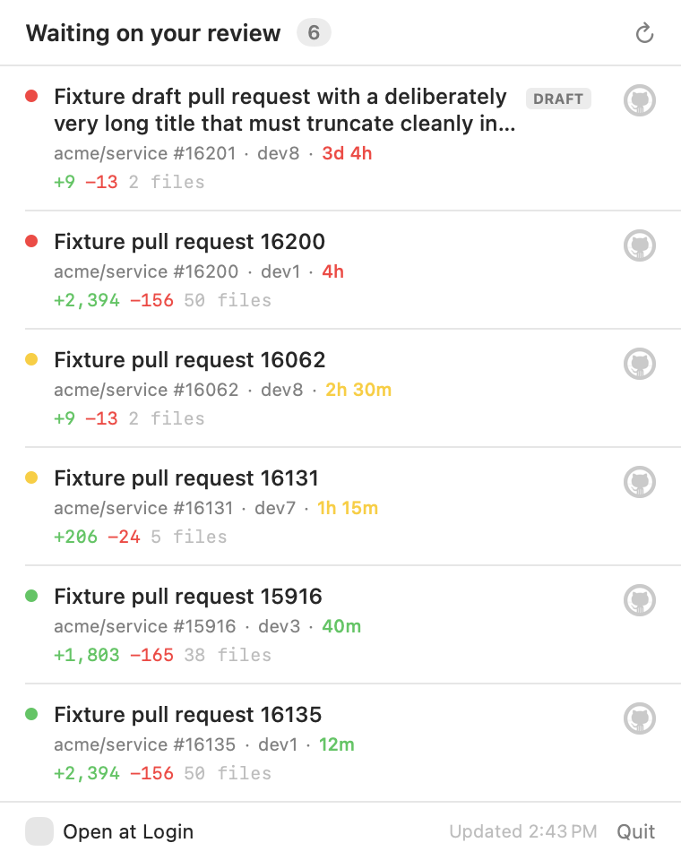

Review requests get buried in email and GitHub notifications, so PRs sit for hours before
you notice. PRStatus puts a single circle in the menu bar that changes colour as your
review queue ages.

## The circle

| | | | | |
|:--:|:--:|:--:|:--:|:--:|
| 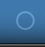 | 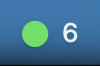 | 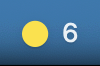 | 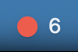 | 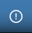 |
| Nothing waiting | Waiting | Over 1 hour | Over 3 hours | Can't reach GitHub |

The colour follows the **worst** item in the queue; the number is how many are waiting.
Everything except the filled states is a template image, so it adapts to a light or dark
menu bar on its own. A dashed circle appears briefly at launch, before the first fetch
returns.

That last state earns its place: **not knowing your queue must never be drawn as an empty
queue.** A hollow "all clear" circle while GitHub is unreachable is a silent failure that
looks like good news, so unreachable, not-yet-loaded and genuinely-empty are three
different glyphs.

Ages advance on their own, without needing a network round trip — the clock is re-read far
more often than GitHub is polled:

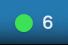

<sub>Recorded with `PRSTATUS_THRESHOLDS=10,20` so the whole progression fits in half a minute.</sub>

## Requirements

- macOS 14 or later
- Swift toolchain — the Command Line Tools are enough, **Xcode is not required**
- [`gh`](https://cli.github.com), signed in (`gh auth login`)

## Install

```sh
./build.sh
open ~/Applications/PRStatus.app
```

`build.sh` runs the tests, builds release, assembles the `.app`, signs it ad-hoc, and
installs to `~/Applications`. There is no `.xcodeproj`: the bundle is assembled by hand
from a SwiftPM build, because `xcodebuild` needs Xcode.

To start it automatically, tick **Open at Login** in the popover footer.

## Usage

Click the circle for the queue. Rows are ordered oldest first, each showing the repository
and number, author, how long it has waited, and the diff size. Click a row to open that PR
in your browser. Drafts are tagged.

The list refreshes every 60 seconds, when you open the popover, and on wake from sleep — a
lid closed for four hours should not reveal a stale green circle.

| | |
|:--:|:--:|
| 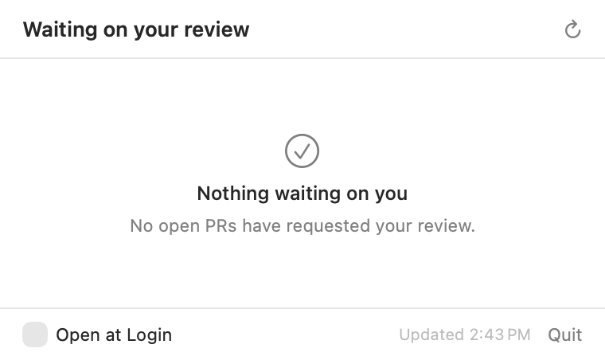 | 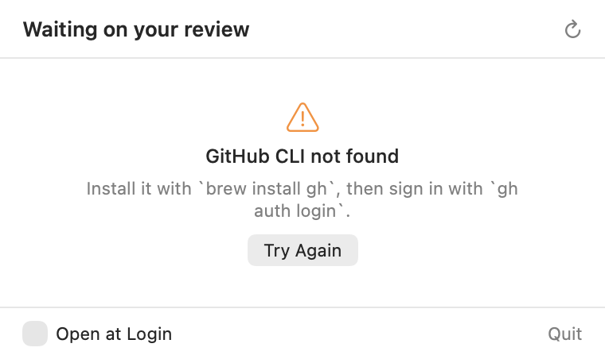 |
| Queue empty | Each failure names its own remedy |

Pending, loading, empty and failed are separate states rather than one empty list, so a
slow request never flashes a false "nothing waiting" and a real error is never silently
swallowed.

GitHub 503s intermittently, and throwing away a good queue over one blip is worse than
showing it with a warning. So a failed *refresh* keeps whatever was already known — rows
or a confirmed-empty queue — and marks it rather than replacing it. A full-screen error is
reserved for having no data at all.

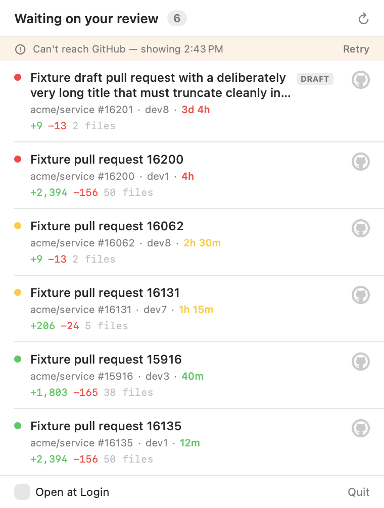

The popover follows your system appearance:

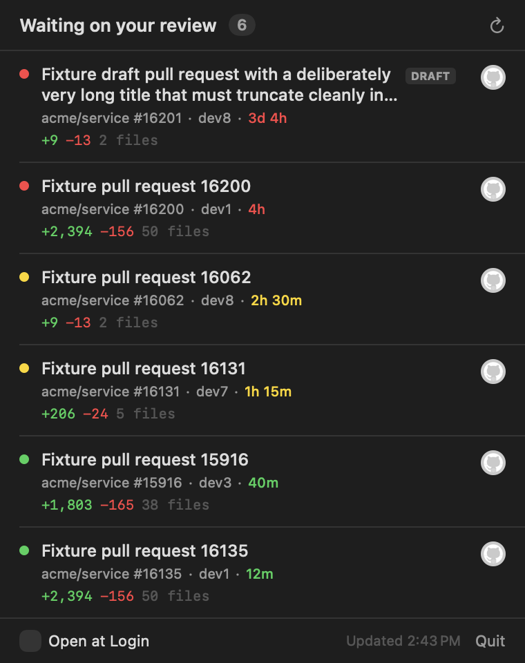

## Authentication

PRStatus shells out to `gh auth token`, so it inherits whichever account `gh` is signed in
as and **stores no credential of its own**. The token goes straight into a request header
and is never logged or written to disk.

`gh` is looked up at absolute paths (`/opt/homebrew/bin/gh`, `/usr/local/bin/gh`,
`/usr/bin/gh`) before falling back to a login shell, because an app launched from Finder
does not inherit Homebrew on its `PATH`.

## How a PR's wait time is measured

This is the part worth knowing, because the obvious approach is wrong.

The clock **cannot** start at the PR's `updatedAt`: a bot commenting on an otherwise
untouched PR resets it, and the circle would never age past green. Instead the wait starts
at the review request itself, resolved in priority order:

1. The most recent review request naming you
2. Otherwise the most recent review request of any kind
3. Otherwise the draft → ready-for-review transition
4. Otherwise the PR's creation

Step 2 is not a formality. A request routed through a **team** carries the team's name and
no login, so nothing in the timeline mentions you — without that fallback, every
team-assigned PR would read as age zero forever and never turn yellow.

Because GitHub drops you from the requested-reviewer list once you submit a review, items
clear themselves; there is nothing to mark as done.

One GraphQL query per refresh, costing 1 point of GitHub's 5000/hour.

## Configuration

All optional. The app ignores them unless set.

| Variable | Effect |
| --- | --- |
| `PRSTATUS_THRESHOLDS=10,20` | Age in seconds rather than 1h/3h, making the colour progression watchable. |
| `PRSTATUS_FIXTURE=<path>` | Load rows from a captured response instead of the network, every item's clock starting at launch. |
| `PRSTATUS_TRACE=1` | Print each icon state change, and the status item's screen frame, to stdout. |
| `PRSTATUS_RENDER=<dir>` | Write a PNG of every popover state in light and dark, then exit. Needs no Screen Recording permission. |
| `PRSTATUS_LOGIN_PROBE=1` | Report whether Open at Login registers via SMAppService or the LaunchAgent fallback, then restore the previous setting. |

Watch the full progression yourself:

```sh
PRSTATUS_FIXTURE=Fixtures/response.json PRSTATUS_THRESHOLDS=10,20 PRSTATUS_TRACE=1 \
  ./.build/debug/PRStatus
```

## Development

```sh
swift build
swift build --product SelfTest && ./.build/debug/SelfTest
```

`swift test` **cannot run here**: the Command Line Tools ship neither XCTest nor
swift-testing. `SelfTest` is a plain executable that asserts and exits non-zero — 85
checks over threshold boundaries, the wait-time cascade, response decoding, duration
formatting, menu bar appearance, fetch-outcome transitions and error presentation. It is
not a framework: no fixture isolation, no parameterisation, and it covers `PRStatusCore`
only. The AppKit and SwiftUI layer is checked with `PRSTATUS_RENDER`.

```
Sources/PRStatusCore/   pure logic, no AppKit — the part SelfTest links
Sources/PRStatus/       status item, popover, launch-at-login
Sources/SelfTest/       assertions
Fixtures/               captured GraphQL response
```

### Fixtures

`Fixtures/response.json` is a real GraphQL response with titles, logins, repository names
and node IDs replaced. The structure is untouched, including the case that matters most: a
review request routed through a team carries a `name` and no `login`.

Its timestamps are fixed, so with real time every row eventually reads as urgent. The
render probe spreads the sample ages across the thresholds so documentation shots show
every colour.

## Limitations

- Only tracks PRs where review is **requested of you** — not `assignee`, not PRs you authored.
- Thresholds are fixed at 1 and 3 hours unless overridden by environment variable.
- Ad-hoc signed. Gatekeeper will need convincing if the bundle is moved between machines.
- No app icon artwork, no auto-update, no notifications.

## Notes on the images above

The menu bar circles and the GIF are real screen captures, cropped to the icon. The
popover shots are rendered offscreen through `NSHostingView` via `PRSTATUS_RENDER`, using
sample data — which is why there is no desktop behind them.
