# PRStatus

A macOS menu bar app that tells you, at a glance, whether anyone is blocked on your code
review — and how long they've been waiting.

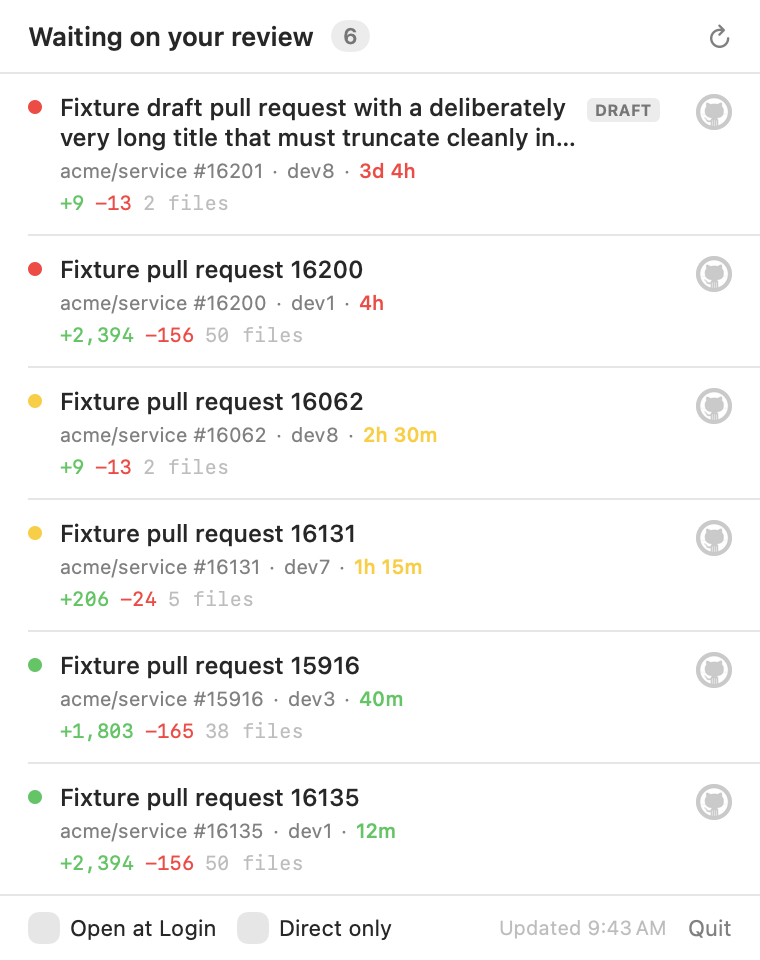

Review requests get buried in email and GitHub notifications, so PRs sit for hours before
you notice. PRStatus puts a single circle in the menu bar that changes colour as your
review queue ages.

## The circle

| | | | | |
|:--:|:--:|:--:|:--:|:--:|
| 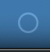 | 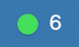 |  | 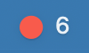 |  |
| Nothing waiting | Waiting | Over 1 hour | Over 3 hours | Can't reach GitHub |

The colour follows the **worst** item in the queue; the number is how many are waiting.
Everything except the filled states is a template image, so it adapts to a light or dark
menu bar on its own. A dashed circle appears briefly at launch, before the first fetch
returns.

That last state earns its place: **not knowing your queue must never be drawn as an empty
queue.** A hollow "all clear" circle while GitHub is unreachable is a silent failure that
looks like good news, so unreachable, not-yet-loaded and genuinely-empty are three
different glyphs.

Ages advance on their own, without needing a network round trip — the clock is re-read far
more often than GitHub is polled:

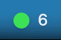

<sub>Recorded with `PRSTATUS_THRESHOLDS=10,20` so the whole progression fits in half a minute.</sub>

## Requirements

- macOS 14 or later
- Swift toolchain — the Command Line Tools are enough, **Xcode is not required**
- [`gh`](https://cli.github.com), signed in (`gh auth login`)

## Install

```sh
./build.sh
open ~/Applications/PRStatus.app
```

`build.sh` runs the tests, builds release, assembles the `.app`, signs it ad-hoc, and
installs to `~/Applications`. There is no `.xcodeproj`: the bundle is assembled by hand
from a SwiftPM build, because `xcodebuild` needs Xcode.

To start it automatically, tick **Open at Login** in the popover footer.

## Usage

Click the circle for the queue. Rows are ordered oldest first, each showing the repository
and number, author, how long it has waited, and the diff size. Click a row to open that PR
in your browser. Drafts are tagged. The header switches between **Your queue** and
**Look up**, which asks the same question about someone else.

The list refreshes every 60 seconds, when you open the popover, and on wake from sleep — a
lid closed for four hours should not reveal a stale green circle.

| | |
|:--:|:--:|
| 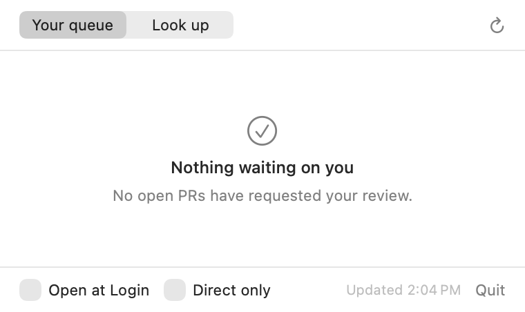 | 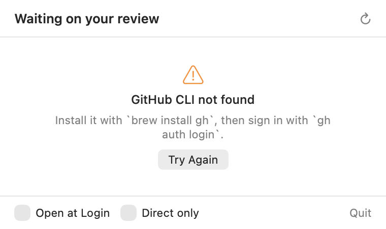 |
| Queue empty | Each failure names its own remedy |

Pending, loading, empty and failed are separate states rather than one empty list, so a
slow request never flashes a false "nothing waiting" and a real error is never silently
swallowed.

GitHub 503s intermittently, and throwing away a good queue over one blip is worse than
showing it with a warning. So a failed *refresh* keeps whatever was already known — rows
or a confirmed-empty queue — and marks it rather than replacing it. A full-screen error is
reserved for having no data at all.

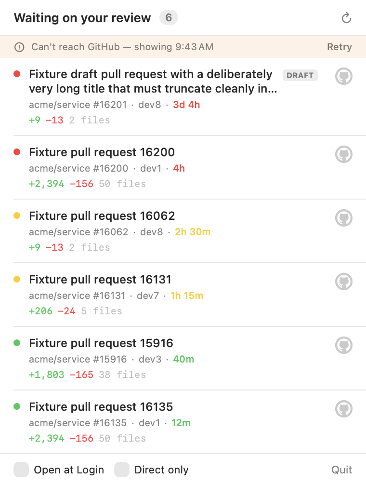

The popover follows your system appearance:

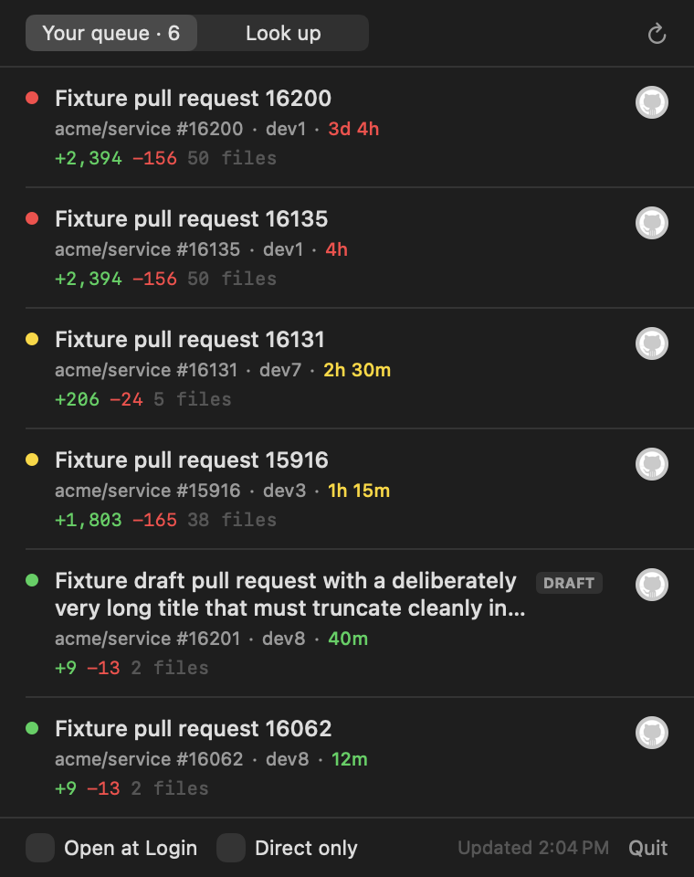

## Direct only

GitHub's `review-requested:@me` search matches two different things: a PR that asks **you**
for review, and a PR that asks a **team** you belong to. On a repository with CODEOWNERS
the second kind can outnumber the first several times over, and it buries the requests
someone actually picked you for.

Tick **Direct only** in the footer to keep just the PRs that name you.

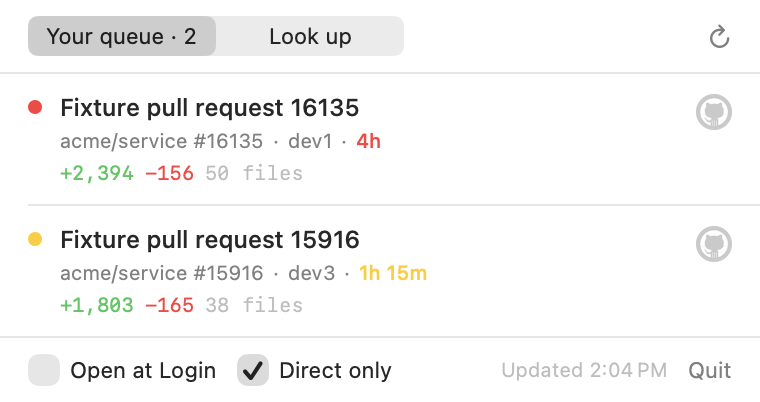

A PR counts as direct when the reviewers currently requested on it include your login. A
team reviewer carries a name and no login, so it never does — the same split GitHub's own
`user-review-requested:@me` search makes. A request that was later withdrawn does not
count, because the list is the PR's present state rather than its history.

The setting persists across launches and starts off, so an upgrade hides nothing you were
already being shown. Toggling it fetches nothing: both kinds arrive in one query, and the
switch only decides what to do with them.

It filters the whole queue rather than just the visible rows. A hidden PR stops counting
toward the menu bar number and can no longer colour the circle — a red circle you cannot
explain from the list would be worse than no filter at all. When the filter empties the
list, the popover says how many PRs sit behind it instead of reporting a clear queue.

## Look up a reviewer

The queue answers "what is waiting on me". The **Look up** pane asks the same question
about somebody else, which is the question you have when you are about to request a
review: who has room for one?

Type a GitHub login and press Return to see the open PRs that name that person as a
reviewer, oldest first, in the same colours as your own queue. Type a team as `org/slug`
to see every member ranked least loaded first: how many PRs name each of them, how long
the oldest has waited, and a bar for comparing at a glance. Click a row to open that
person's requests on GitHub.

| | |
|:--:|:--:|
| 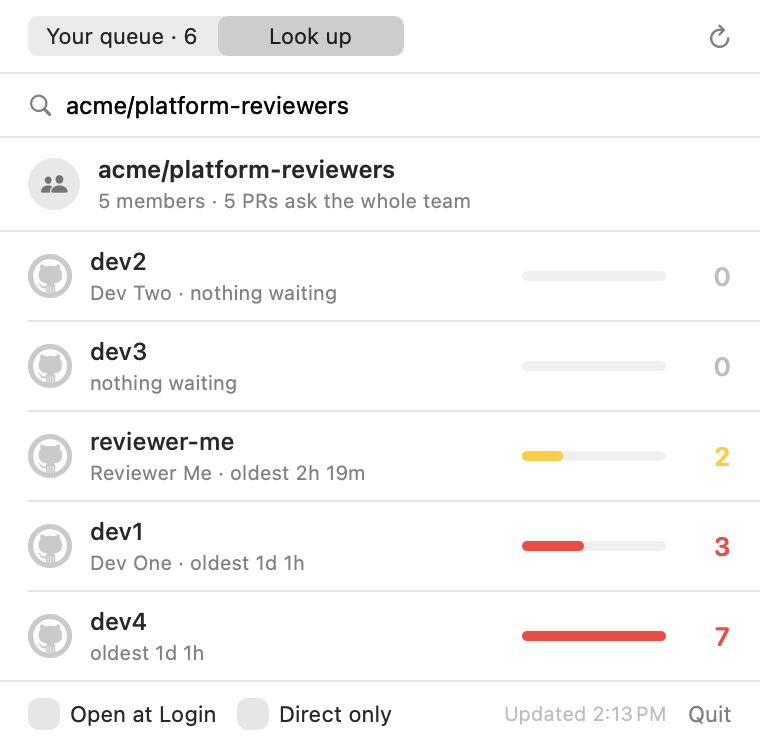 | 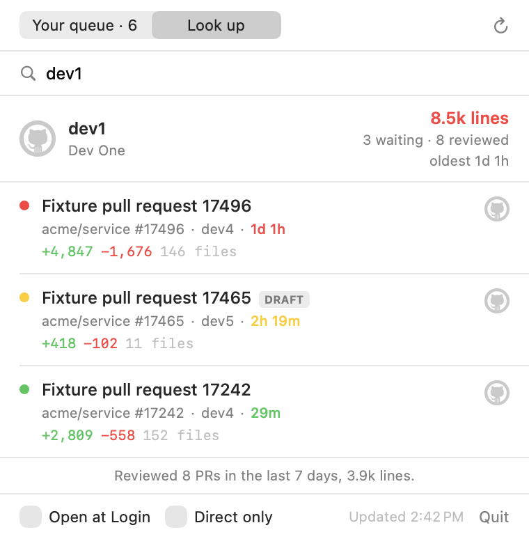 |
| A team, least loaded first | One person |

Counts are **direct requests only** — GitHub's `user-review-requested:` qualifier, the
same split the Direct only filter makes. A PR requested from the team itself sits in every
member's queue alike, so it says nothing about whom to pick; the header reports those
once instead of adding them to each row.

The ranking puts the fewest requests first. Among equals, the person whose oldest request
is newest is less behind. Nothing waiting ranks above anything waiting, and ties fall back
to login so the order holds still between refreshes.

A person costs one request. A team costs one request for the roster, then one search per
member, six to a request, run concurrently. GitHub runs the searches inside a request one
after another at a few hundred milliseconds each and cuts the request off at ten seconds,
so six is the batch size, and a team of forty takes about as long as a team of six: around
five seconds. Each member costs about one rate-limit point of the 5000 an hour. The pane
refreshes only while it is showing, so the menu bar's poll stays at one point a minute.

The last name persists, so your own team is one click away. An unknown login or team gets
its own message rather than an empty list: not-found is an answer, not a failure, and is
never drawn like an unreachable GitHub. Teams are visible only inside organizations your
`gh` account belongs to, with the `read:org` scope that `gh auth login` grants by default.

## Authentication

PRStatus shells out to `gh auth token`, so it inherits whichever account `gh` is signed in
as and **stores no credential of its own**. The token goes straight into a request header
and is never logged or written to disk.

`gh` is looked up at absolute paths (`/opt/homebrew/bin/gh`, `/usr/local/bin/gh`,
`/usr/bin/gh`) before falling back to a login shell, because an app launched from Finder
does not inherit Homebrew on its `PATH`.

## How a PR's wait time is measured

This is the part worth knowing, because the obvious approach is wrong.

The clock **cannot** start at the PR's `updatedAt`: a bot commenting on an otherwise
untouched PR resets it, and the circle would never age past green. Instead the wait starts
at the review request itself, resolved in priority order:

1. The most recent review request naming you
2. Otherwise the most recent review request of any kind
3. Otherwise the draft → ready-for-review transition
4. Otherwise the PR's creation

Step 2 is not a formality. A request routed through a **team** carries the team's name and
no login, so nothing in the timeline mentions you — without that fallback, every
team-assigned PR would read as age zero forever and never turn yellow.

Because GitHub drops you from the requested-reviewer list once you submit a review, items
clear themselves; there is nothing to mark as done.

One GraphQL query per refresh, costing 1 point of GitHub's 5000/hour.

## Configuration

All optional. The app ignores them unless set.

| Variable | Effect |
| --- | --- |
| `PRSTATUS_THRESHOLDS=10,20` | Age in seconds rather than 1h/3h, making the colour progression watchable. |
| `PRSTATUS_FIXTURE=<path>` | Load rows from a captured response instead of the network, every item's clock starting at launch. |
| `PRSTATUS_TRACE=1` | Print each icon state change, and the status item's screen frame, to stdout. |
| `PRSTATUS_RENDER=<dir>` | Write a PNG of every popover state in light and dark, then exit. Needs no Screen Recording permission. |
| `PRSTATUS_LOOKUP_PROBE=<name>` | Run one lookup against GitHub, print what the pane would show and how long it took, then exit. |
| `PRSTATUS_LOGIN_PROBE=1` | Report whether Open at Login registers via SMAppService or the LaunchAgent fallback, then restore the previous setting. |

Watch the full progression yourself:

```sh
PRSTATUS_FIXTURE=Fixtures/response.json PRSTATUS_THRESHOLDS=10,20 PRSTATUS_TRACE=1 \
  ./.build/debug/PRStatus
```

## Development

```sh
swift build
swift build --product SelfTest && ./.build/debug/SelfTest
```

`swift test` **cannot run here**: the Command Line Tools ship neither XCTest nor
swift-testing. `SelfTest` is a plain executable that asserts and exits non-zero — 168
checks over threshold boundaries, the wait-time cascade, the direct-versus-team split,
response decoding, duration formatting, menu bar appearance, fetch-outcome transitions,
error presentation, lookup parsing, reviewer ranking and the not-found-versus-failure
split. It is not a framework: no fixture isolation, no parameterisation, and
it covers `PRStatusCore` only. The AppKit and SwiftUI layer is checked with
`PRSTATUS_RENDER`.

```
Sources/PRStatusCore/   pure logic, no AppKit — the part SelfTest links
Sources/PRStatus/       status item, popover, launch-at-login
Sources/SelfTest/       assertions
Fixtures/               captured GraphQL responses
```

### Fixtures

`Fixtures/response.json` is a real GraphQL response with titles, logins, repository names
and node IDs replaced. The structure is untouched, including the case that matters most: a
review request routed through a team carries a `name` and no `login`. Two of its six PRs
name the viewer directly, so the **Direct only** filter has something to keep and something
to drop.

`Fixtures/lookup-user.json`, `lookup-team.json` and `lookup-team-load.json` are the three
responses behind one team lookup, anonymised the same way: the roster, and the aliased
per-member searches that the roster's order indexes into. With `PRSTATUS_FIXTURE` set, any
login shows the captured person and any `org/slug` the captured team.

Their timestamps are fixed, so with real time every row eventually reads as urgent. The
render probe spreads the sample ages across the thresholds so documentation shots show
every colour.

## Limitations

- The menu bar tracks only PRs where review is **requested of you** — not `assignee`, not
  PRs you authored.
- A team's roster is cut at 100 members, and a person's oldest wait is read from their
  first 30 PRs, oldest-created first.
- Thresholds are fixed at 1 and 3 hours unless overridden by environment variable.
- Ad-hoc signed. Gatekeeper will need convincing if the bundle is moved between machines.
- No app icon artwork, no auto-update, no notifications.

## Notes on the images above

The menu bar circles and the GIF are real screen captures, cropped to the icon. The
popover shots are rendered offscreen through `NSHostingView` via `PRSTATUS_RENDER`, using
sample data — which is why there is no desktop behind them.
